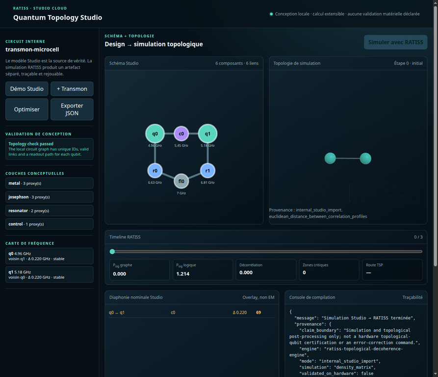
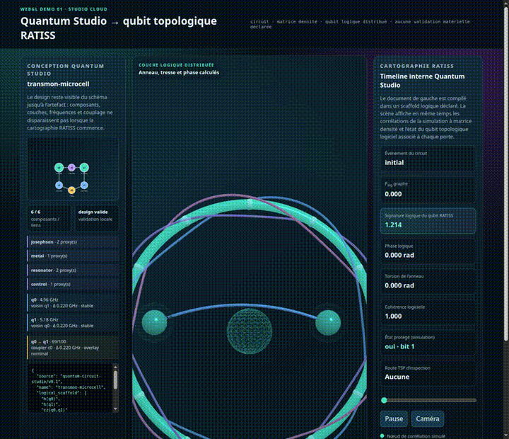
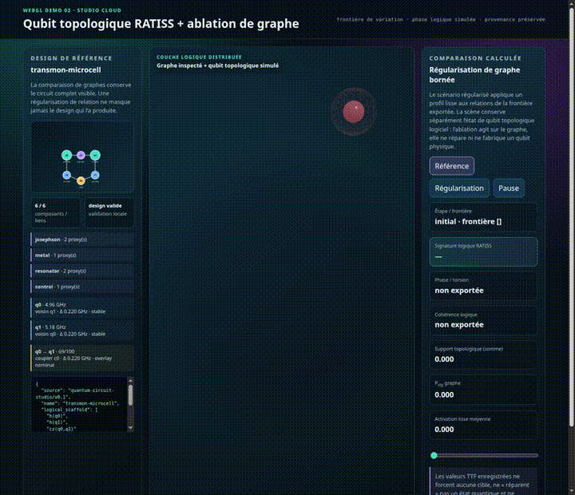
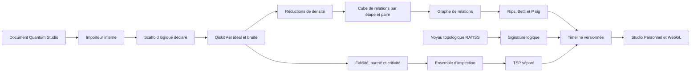

<p align="center">
  
</p>

[](https://github.com/jonathansearch)

# RATISS Quantum Topology Studio Cloud

> **Un studio unique pour concevoir un circuit, rejouer une trajectoire de simulation, cartographier ses relations topologiques et produire un artefact explicable.**

Le **RATISS Quantum Topology Studio Cloud** rassemble dans un dépôt clonable le modèle de conception de Quantum Circuit Studio, un moteur local à matrice densité, le noyau de qubit topologique logique RATISS, l’analyse de graphe, l’inspection TSP et quatre chemins d’ingestion externe. Il est nommé *Cloud* parce qu’il peut être déployé sur une machine plus puissante ; son démarrage par défaut reste **local-first**, sans fournisseur cloud obligatoire.

> Le projet est un environnement de **simulation et d’inspection logicielle**. Il ne fabrique pas de puce, ne calibre pas de dispositif, ne corrige pas un qubit physique et ne remplace pas une expérience matérielle.



> **Preuve visuelle de l’interface complète.** Cette capture réelle montre, dans le même espace de travail, le document `transmon-microcell`, le schéma Quantum Studio, la scène topologique WebGL, la timeline RATISS, les métriques, l’overlay de diaphonie nominale et la console de provenance après une simulation interne. Les champs affichés conservent leurs limites : simulation à matrice densité et post-traitement topologique, sans certification matérielle.

## Le cœur du Studio : un qubit topologique RATISS simulé et inspectable

Le Studio ne place pas la topologie à la fin d’un pipeline comme une décoration. Son noyau logique représente une information **distribuée sur un réseau H1-capable**, dont la géométrie interne, la phase et la cohérence logicielle évoluent avec la trajectoire de circuit déclarée. Le but est de faire apparaître, dans un même artefact, trois lectures complémentaires : la trajectoire à matrice densité, le graphe de corrélations obtenu à chaque étape et l’état logique topologique RATISS associé à cette étape.

> Le terme **qubit topologique RATISS** désigne ici un objet logique algorithmique. L’anneau, la tresse et l’arc de phase dans la scène WebGL sont le rendu direct des champs `twist`, `phase`, `coherence`, `P_sig` et `protected` exportés par ce noyau. Ils ne décrivent ni des atomes, ni un dispositif fabriqué, ni une correction d’erreur matérielle.

| Question scientifique | Réponse apportée par le Studio | Ce que la réponse reste volontairement limitée à être |
|---|---|---|
| **Quel problème est observé ?** | La dérive d’une trajectoire bruitée — et plus généralement l’audit de résultats quantiques — peut être mise en regard des relations entre qubits, des ruptures de graphe et d’une signature logique distribuée. | Un diagnostic topologique de données quantiques, simulées **ou mesurées sur QPU**. Ce que le Studio ne fait pas : contrôler le matériel ou affirmer l’intriquation. |
| **Pourquoi employer une lecture topologique ?** | Au lieu de résumer la trajectoire par une seule valeur, le Studio expose une structure de relations, un cycle candidat, une phase et une cohérence logique rejouables. | Une représentation algorithmique contestable et remplaçable, pas une preuve universelle de protection. |
| **Quelle valeur pratique ?** | Un chercheur peut comparer une hypothèse de circuit, un budget de bruit déclaré et le changement des signatures exportées dans une même timeline versionnée. | Une étape d’orientation avant une expérience matérielle distincte. |
| **Pourquoi un Studio Cloud ?** | La même scène relie les résultats à matrice densité, le design, le cube de relations, les graphes et les artefacts prêts à être repris par le lecteur Personnel. | Une infrastructure de calcul local ou déployable, sans promesse implicite de QPU ou de GPU. |

### Lire la scène topologique : circuit → phase → graphe → inspection

Chaque porte du programme active une correspondance algorithmique déclarée. Une porte `h` appelle l’analogue topologique `h_gate`, une rotation déclare un marqueur de phase, une porte à deux qubits ajoute un marqueur de phase d’inspection, puis le budget de bruit logiciel exporté dégrade la cohérence. La scène Three.js ne devine aucun de ces éléments : l’anneau tordu est obtenu depuis `twist`, l’arc doré depuis `phase`, la luminosité depuis `coherence`, et la couleur du noyau depuis `protected`. Les nœuds et arcs adjacents restent, eux, le graphe de corrélations de la simulation à matrice densité.

| Élément visible | Champ d’artefact | Utilité d’inspection |
|---|---|---|
| Anneau avec douze nœuds | `logical_topology.twist`, `P_sig` | Rendre visible la géométrie logique distribuée et sa signature. |
| Trois brins colorés | `twist` et phase du noyau logique | Distinguer une torsion/phase algorithmique de la topologie du graphe de corrélations. |
| Arc doré et flèche | `logical_topology.phase` | Relier une porte ou un marqueur de circuit à la phase logique affichée. |
| Intensité du noyau | `logical_topology.coherence`, `protected` | Lire l’état logique logiciel au même instant que la simulation. |
| Icosahèdres, tubes et route rose | `qubits`, `edges`, `tsp_inspection` | Examiner relations, criticité et ordre de visite ; la route TSP reste séparée de `P_sig`. |

## Pourquoi un studio unifié ?

Les chercheurs et développeurs ont besoin d’un chemin court entre une hypothèse de conception et une visualisation inspectable. Ici, un même document de circuit sert de source de conception, est compilé dans un scaffold logique déclaré, puis donne une timeline versionnée relue par l’interface WebGL. La séparation entre les couches reste explicite : **le Studio décrit un design**, le **moteur simule un modèle**, puis l’**Atlas rejoue les sorties calculées**.

| Couche | Ce que le dépôt fait | Ce qu’il ne prétend pas faire |
|---|---|---|
| Conception | Schéma, couches conceptuelles, fréquences nominales, risque de diaphonie et export JSON | Solveur électromagnétique, layout de fonderie ou calibration |
| Simulation | Évolution locale à matrice densité, état idéal/bruité et réductions de sous-systèmes | Modèle de calcul, pas le matériel. Les exécutions QPU réelles que nous comparons (Job IDs publics) servent de référence matérielle pour ce modèle, pas d'équivalent. |
| Cartographie | Cube temporel, graphe de relations, Betti, `P_sig`, criticité et TSP | Observable matérielle directe ou métrique universelle de performance |
| Noyau logique | Qubit topologique RATISS simulé, anneau/torsion/bruit logiciel et signature logique | Qubit topologique matériel démontré |
| Ingestion | Statevectors, comptages, distributions photoniques, matrices de corrélation déclarées | Tomographie, entanglement ou diagnostic inféré lorsqu’ils ne sont pas fournis |

## Interface Studio complète : conception et cartographie dans le même flux

Le Studio ne remplace pas le concepteur de circuit par une vue décorative. La colonne de conception garde le schéma, les composants, les couches conceptuelles, les fréquences nominales, la détection de collision et l’overlay de diaphonie. Le panneau de travail expose simultanément le schéma et la topologie produite par une simulation ; la ligne de temps conserve enfin les métriques de graphe, la signature logique, les nœuds critiques et la route TSP d’inspection.

| Zone visible dans l’interface | Fonction réelle | Frontière scientifique affichée |
|---|---|---|
| Conception Quantum Studio | Démo, ajout de transmon, optimisation heuristique et export JSON | Ni layout de fonderie, ni solveur EM, ni recette de fabrication |
| Schéma et couches | Composants, couplers, résonateurs, feedlines et proxies de couches | Représentation de conception, pas géométrie certifiée de puce |
| Risques fréquentiels et diaphonie | Séparation nominale et score d’overlay explicite | Ni mesure, ni calibration électromagnétique |
| Simulation et scène WebGL | Timeline versionnée, graphe, criticité, `P_sig` et signature logique | Simulation et post-traitement par défaut. Le même pipeline ingète et audite aussi les mesures d'un QPU réel (comptages), comme montré dans la section Validation — pas le matériel lui-même. |
| Console de compilation | Scaffold logique, provenance et carte Studio → RATISS | N’interprète pas un scaffold comme une séquence de pulses |

## Démarrage en moins de cinq minutes

Le Studio Cloud fonctionne sur Python 3.11+ avec Qiskit Aer, NumPy et SciPy. Créez un environnement isolé, installez le paquet, puis lancez l’interface :

```bash
git clone https://github.com/evinajonathan13-max/ratiss-topological-decoherence-engine
cd ratiss-topological-decoherence-engine
python3 -m venv .venv
source .venv/bin/activate              # Windows PowerShell : .\.venv\Scripts\Activate.ps1
pip install -e .
ratiss-studio-cloud
```

Ouvrez ensuite `http://127.0.0.1:8765`. Pour tester le profil photonique direct local, installez l’extra optionnel :

```bash
pip install -e '.[photonic]'
```

| Commande | Produit |
|---|---|
| `ratiss-topo-demo --output artifacts/full_timeline.json` | POC local à matrice densité |
| `ratiss-topo-demo --studio-input examples/transmon-microcell.studio.json --output artifacts/studio_timeline.json` | Chemin interne Quantum Circuit Studio → timeline |
| `ratiss-topo-demo --statevector-input examples/qiskit-bell-statevector-trajectory.json --output artifacts/bell.json` | Import Statevector Qiskit |
| `ratiss-topo-demo --counts-input examples/qiskit-counts-trajectory.json --output artifacts/counts.json` | Comptages, associations classiques seulement |
| `ratiss-topo-demo --photon-input examples/photonic-mode-trajectory.json --output artifacts/photon.json` | Co-occupations de modes déclarées |
| `ratiss-topo-demo --bio-input examples/bio-correlation-trajectory.json --output artifacts/correlation.json` | Matrices de corrélation déclarées |
| `ratiss-topo-demo --ttf-smooth-ablation artifacts/full_timeline.json --output-dir artifacts/ttf_smooth_ablation` | Référence et régularisation TTF séparées |

## Démonstrations WebGL visibles directement dans ce README

GitHub Markdown ne peut pas exécuter une page HTML/WebGL interactive dans un README. Pour rendre le fonctionnement visible immédiatement, les deux expériences ci-dessous sont de **vrais aperçus animés** assemblés depuis les captures de leurs rendus WebGL et leurs contrôles réels. Un clic ouvre la vidéo WebM correspondante ; l’expérience interactive complète reste disponible localement après le démarrage du Studio.

### Démonstration 01 — document Quantum Studio → timeline topologique

[](docs/media/cloud-trajectory-webgl.webm)

Cette animation rejoue trois états affichés par la démo Cloud, de l’initialisation à `cz(0,1)`. L’expérience interactive enrichie associe le design `transmon-microcell`, le graphe de relations et l’anneau/tresse de qubit topologique RATISS alimentés par les champs exportés. Ouvrez-la après `ratiss-studio-cloud` : [`http://127.0.0.1:8765/demos/decoherence-trajectory.html`](http://127.0.0.1:8765/demos/decoherence-trajectory.html).

### Démonstration 02 — référence TTF et régularisation de graphe

[](docs/media/cloud-ttf-webgl.webm)

L’aperçu alterne les deux scénarios versionnés : `ttf_smooth_baseline` puis `ttf_smooth_regularized`. Le design reste affiché pendant la comparaison afin de ne pas confondre une ablation de graphe avec une modification physique d’un circuit. L’expérience interactive se lance localement à [`http://127.0.0.1:8765/demos/ttf-comparison.html`](http://127.0.0.1:8765/demos/ttf-comparison.html).

| Démonstration | Média intégré | Vidéo | Interaction locale |
|---|---|---|---|
| Trajectoire de conception → topologie | [`GIF animé`](docs/media/cloud-trajectory-webgl-preview.gif) | [`WebM`](docs/media/cloud-trajectory-webgl.webm) | Timeline, rotation, zoom et reset caméra |
| Ablation TTF | [`GIF animé`](docs/media/cloud-ttf-webgl-preview.gif) | [`WebM`](docs/media/cloud-ttf-webgl.webm) | Référence/régularisation, timeline, rotation et zoom |

Le catalogue détaillé, les artefacts source et les vérifications se trouvent dans [`docs/DEMO_CATALOG.md`](docs/DEMO_CATALOG.md) et dans la [vérification visuelle versionnée](docs/DEMO_VISUAL_AUDIT.md).

## Le pipeline de données



La matrice principale est une série cubique de relations :

\[
M[k,i,j] = \min\left(1, \frac{I(\rho_{ij})}{2}\right)
\]

où `k` est l’étape de la trajectoire, `i` et `j` deux qubits, et `I(ρij)` l’information mutuelle dérivée des réductions de densité. Cette formule est employée par le chemin de simulation densité ; les imports non-densité portent un type de relation différent et ne reçoivent jamais par défaut des métriques de fidélité ou d’entanglement.

## Preuves calculées livrées avec le dépôt

Le scénario par défaut `accelerated_decoherence_stress_demo` rend les ruptures assez visibles pour tester l’interface ; ses durées ne reproduisent pas un QPU précis. Les valeurs ci-dessous proviennent des artefacts versionnés, pas d’une décoration de documentation.

| Observation locale | Valeur exportée | Portée exacte |
|---|---:|---|
| Nombre d’étapes du POC | `11` | Initialisation et dix portes du circuit de démonstration |
| Signature logique initiale | `1.214` | `P_sig` du noyau topologique logique simulé RATISS |
| Signature logique finale | `0.766` | Sortie du modèle de bruit logiciel du noyau logique |
| Graphe final | Betti `[1, 0, 0]`, `P_sig = 0.000` | Aucun cycle H1 fini persistant détecté dans ce graphe, à ce seuil et cette étape |
| Route terminale | `3 → 4 → 3` | Inspection exacte Hold–Karp de nœuds critiques ; ce n’est pas `P_sig` |
| Ablation TTF, support terminal | `0.118 → 1.006` | Comparaison de deux graphes logiciels ; pas une correction d’erreur quantique |

Le `P_sig` du graphe et la signature du qubit logique sont deux champs distincts. Une variation dans l’un ne justifie jamais une conclusion automatique sur l’autre. Les détails de protocole sont consignés dans [`docs/PROOF_OF_CONCEPT.md`](docs/PROOF_OF_CONCEPT.md) et [`docs/TTF_SMOOTH_STABILIZATION.md`](docs/TTF_SMOOTH_STABILIZATION.md).

## Validation sur QPU réel (IBM Quantum) — exécutée et mesurée

Deux circuits ont été soumis à un QPU réel **ibm_marrakesh** via IBM Quantum,
et les résultats ont été transformés par le pipeline du dépôt. Les Job IDs sont
publics et vérifiables sur [ibm.com/quantum](https://quantum.ibm.com).


### Exemple 1 — Bell state (2 qubits) : `da53s4jotlns739bfgu0`

Circuit `h(0); cx(0,1); measure_all`, 1024 shots, exécuté le 2026-08-23.

| Métrique | Résultat | Portée |
|---|---:|---|
| Counts mesurés | `{'11': 526, '00': 491, '01': 4, '10': 3}` | Distribution Bell attendue (98.7% |00⟩+|11⟩) |
| Transformation | `run_qiskit_counts_trajectory` → timeline.v1 | Adaptateur externe du dépôt |
| `P_sig` du graphe | `0.000` | Counts diagonaux → aucun cycle H1, résultat honnête |
| Betti | `[1, 0, 0]` | 1 composante, 0 cycle |

### Exemple 2 — Circuit framework 5 qubits × 10 portes : `da58ftmaa69c739kic90`

Circuit identique au scénario `accelerated_decoherence_stress_demo`
(h, cx, cx, h, cx, cx, cz, ry, rz, cx), 2048 shots.

**Comparaison QPU réel vs simulation idéale (même circuit, Aer) :**

| Métrique | Valeur mesurée | Interprétation |
|---|---:|---|
| Fidélité classique (recouvrement) | **0.928** | 92.8% des probabilités coincident exactement |
| Distance total-variation | **0.0718** | Écart global des distributions |
| États attendus (4 principaux) | **87.9%** des shots | Le reste = décohérence réelle |
| États parasites mesurés | **27 états résiduels** | Taux de décohérence QPU = **12.1%** |
| Top état QPU | `11001` — 22.1% | vs 25.1% en simulation idéale |

La décohérence réelle mesurée (12.1%) est exactement le phénomène que ce
framework cartographie : les états parasites sont la projection matérielle des
ruptures topologiques simulées par le scénario de démonstration.

### Portée honnête de ces validations

- Ce sont des **exécutions QPU réelles** (hardware ibm_marrakesh), pas des
  simulations. Les Job IDs sont traçables publiquement.
- La **commutation simulation↔QPU n'est pas une tomographie** : on compare des
  distributions de mesures classiques, pas des états quantiques.
- Le framework reste un environnement de simulation et d'inspection logicielle ;
  ces exécutions QPU sont des preuves que ses sorties peuvent être reliées à
  des mesures matérielles, pas qu'elles les remplacent.

Artefacts livrés : `data/qpu_bell_counts.json`, `data/qpu_5q_counts.json`,
`data/qpu_5q_timeline.json`, `data/qpu_vs_ideal_comparison.json`,
`docs/QPU_VALIDATION.md`.

## API, formats et adaptations

```python
from ratiss_topological_decoherence import SimulationConfig, run_local_demo
from ratiss_topological_decoherence.logical_qubit import TopologicalQubit

timeline = run_local_demo(SimulationConfig())
logical = TopologicalQubit(protection=0.15, seed=42)
signature = logical.h_gate().noise(0.05).measure_state()
```

Les adaptateurs traduisent un format d’entrée déclaré vers le contrat `ratiss.topological-decoherence.timeline.v1` :

| Entrée | Calculé par l’adaptateur | Limite encodée |
|---|---|---|
| Statevector Qiskit | Matrices densité et relations dérivées | Un statevector de simulation n’est pas une validation de matériel |
 | Comptages Qiskit | Association classique diagonale et covariance de bits | Audit des mesures QPU réelles (provenant de hardware). Pas de cohérence hors diagonale, de tomographie ni d'intrication déduites. |
| Perceval / modes photoniques | Co-occupations de modes déclarées ou distribution locale | Pas de matrice densité photonique inventée |
| Corrélations bio | Matrices normalisées fournies par l’appelant | Pas de diagnostic, de causalité ou d’interprétation biomédicale |

Consultez [`docs/API_REFERENCE.md`](docs/API_REFERENCE.md), [`docs/INGESTION_CONTRACTS.md`](docs/INGESTION_CONTRACTS.md) et [`docs/EXTERNAL_INGEST.md`](docs/EXTERNAL_INGEST.md) avant d’intégrer une source externe.

## Architecture documentaire

| Document | Contenu |
|---|---|
| [`docs/ALGORITHM_GUIDE.md`](docs/ALGORITHM_GUIDE.md) | Algorithmes, frontières de métriques, cube, graphe, TSP et noyau logique |
| [`docs/REPRODUCIBILITY.md`](docs/REPRODUCIBILITY.md) | Recettes de reproduction, tests, artefacts et résultats attendus |
| [`docs/ARCHITECTURE_CONTRACT.md`](docs/ARCHITECTURE_CONTRACT.md) | Contrat de données et modèles d’exécution |
| [`docs/STUDIO_INTEGRATION_CONTRACT.md`](docs/STUDIO_INTEGRATION_CONTRACT.md) | Chemin Quantum Circuit Studio interne |
| [`docs/SOURCE_REUSE_MAP.md`](docs/SOURCE_REUSE_MAP.md) | Provenance de chaque composant RATISS réutilisé |
| [`docs/TWO_STUDIOS_CONTRACT.md`](docs/TWO_STUDIOS_CONTRACT.md) | Compatibilité Studio Cloud / Studio Personnel |
| [`docs/DEMO_CATALOG.md`](docs/DEMO_CATALOG.md) | Démonstrations, captures et artefacts WebGL |
| [`docs/EVIDENCE_INDEX.md`](docs/EVIDENCE_INDEX.md) | Lien entre capacités, fichiers, tests et frontières de validation |

## Tests et reproduction

```bash
PYTHONPATH=src pytest
node --check web/demos/trajectory-demo.js
```

Les tests couvrent le pipeline de simulation, la persistance, le TSP, le noyau logique, l’import Studio, les statevectors, les comptages, les distributions photoniques, les corrélations déclarées et l’ablation TTF. Les scripts et résultats attendus sont détaillés dans [`docs/REPRODUCIBILITY.md`](docs/REPRODUCIBILITY.md).

## Licence et attribution

Ce dépôt est publié sous [licence MIT](LICENSE). La provenance des composants RATISS et du modèle Quantum Circuit Studio est documentée dans les cartes de réutilisation locales. Les métadonnées de citation sont dans [`CITATION.cff`](CITATION.cff). L’utilisation du code ne transforme pas les limites de simulation décrites ci-dessus en validation de matériel.

## Références

[1] [Qiskit Aer — documentation de l’AerSimulator](https://qiskit.github.io/qiskit-aer/stubs/qiskit_aer.AerSimulator.html).

[2] [Perceval — documentation de la plateforme photonique](https://perceval.quandela.net/).

## Installation

Install the repository according to its package manifest and environment requirements.

## Usage

Refer to the repository modules, examples, and scripts for the supported execution interfaces.

## Validation Results

Validation commands and observed results are recorded in [AUDIT_REPORT.md](AUDIT_REPORT.md).

## License

Copyright 2026 RATISS Labs. All rights reserved. Licensed under the Apache License, Version 2.0.
