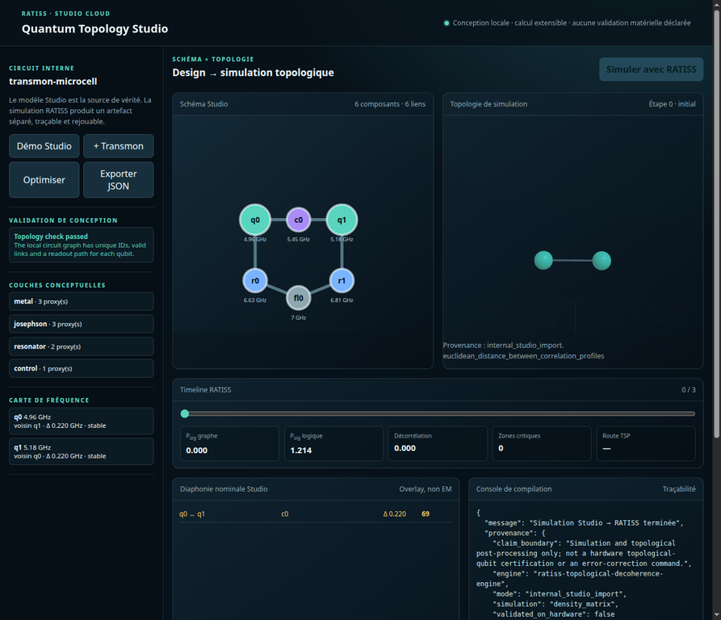
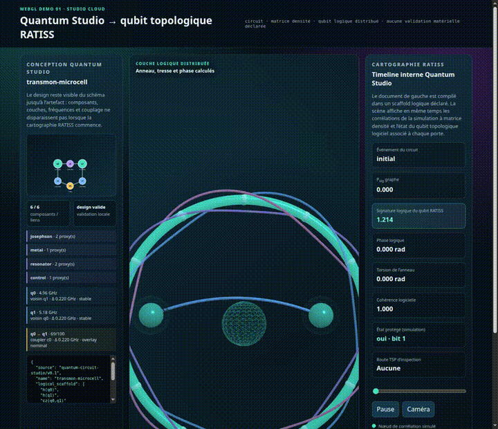
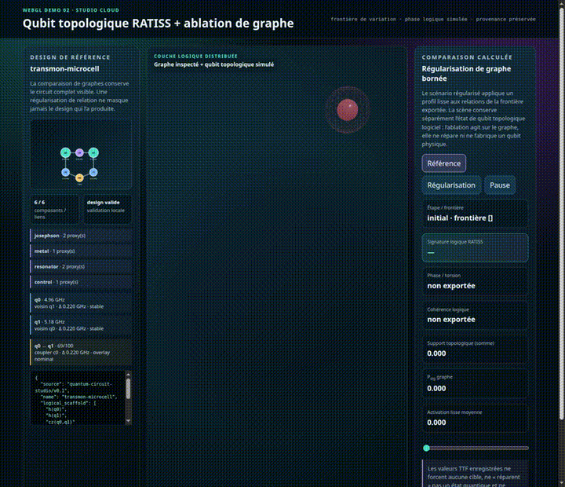
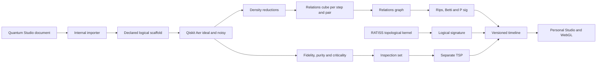

<p align="center">
  
</p>

[](https://github.com/jonathansearch)

# RATISS Quantum Topology Studio Cloud

> **A single studio to design a circuit, replay a simulation trajectory, map its topological relations and produce an explainable artifact.**

The **RATISS Quantum Topology Studio Cloud** brings together in a cloneable repository the design model of Quantum Circuit Studio, a local density-matrix engine, the RATISS logical topological qubit kernel, graph analysis, TSP inspection and four external ingestion paths. It is named *Cloud* because it can be deployed on a more powerful machine; its default startup remains **local-first**, with no mandatory cloud provider.

> The project is a **software simulation and inspection** environment. It does not fabricate a chip, does not calibrate a device, does not correct a physical qubit and does not replace a hardware experiment.



> **Visual proof of the complete interface.** This real capture shows, in the same workspace, the `transmon-microcell` document, the Quantum Studio schematic, the WebGL topological scene, the RATISS timeline, the metrics, the nominal crosstalk overlay and the provenance console after an internal simulation. The displayed fields keep their limits: density-matrix simulation and topological post-processing, with no hardware certification.

## The heart of the Studio: a simulated and inspectable RATISS topological qubit

The Studio does not place topology at the end of a pipeline as a decoration. Its logical kernel represents information **distributed over an H1-capable network**, whose internal geometry, phase and software coherence evolve with the declared circuit trajectory. The goal is to surface, within a single artifact, three complementary readings: the density-matrix trajectory, the correlation graph obtained at each step and the RATISS topological logical state associated with that step.

> The term **RATISS topological qubit** refers here to an algorithmic logical object. The ring, the braid and the phase arc in the WebGL scene are the direct rendering of the `twist`, `phase`, `coherence`, `P_sig` and `protected` fields exported by this kernel. They describe neither atoms, nor a fabricated device, nor hardware error correction.

| Scientific question | Answer provided by the Studio | What the answer deliberately remains limited to being |
|---|---|---|
| **What problem is observed?** | The drift of a noisy trajectory — and more generally the audit of quantum results — can be set against the relations between qubits, the graph ruptures and a distributed logical signature. | A topological diagnosis of quantum data, simulated **or measured on QPU**. What the Studio does not do: control the hardware or assert entanglement. |
| **Why use a topological reading?** | Instead of summarizing the trajectory with a single value, the Studio exposes a structure of relations, a candidate cycle, a phase and a replayable logical coherence. | A contestable and replaceable algorithmic representation, not a universal proof of protection. |
| **What practical value?** | A researcher can compare a circuit hypothesis, a declared noise budget and the change of the exported signatures within the same versioned timeline. | An orientation step before a distinct hardware experiment. |
| **Why a Cloud Studio?** | The same scene links the density-matrix results, the design, the relations cube, the graphs and the artifacts ready to be picked up by the Personal reader. | A local or deployable computing infrastructure, with no implicit promise of QPU or GPU. |

### Reading the topological scene: circuit → phase → graph → inspection

Every gate of the program activates a declared algorithmic correspondence. An `h` gate calls the topological analogue `h_gate`, a rotation declares a phase marker, a two-qubit gate adds an inspection phase marker, then the exported software noise budget degrades the coherence. The Three.js scene guesses none of these elements: the twisted ring is obtained from `twist`, the golden arc from `phase`, the brightness from `coherence`, and the core color from `protected`. The adjacent nodes and arcs, for their part, remain the correlation graph of the density-matrix simulation.

| Visible element | Artifact field | Inspection use |
|---|---|---|
| Ring with twelve nodes | `logical_topology.twist`, `P_sig` | Make the distributed logical geometry and its signature visible. |
| Three colored strands | `twist` and phase of the logical kernel | Distinguish an algorithmic twist/phase from the topology of the correlation graph. |
| Golden arc and arrow | `logical_topology.phase` | Link a gate or a circuit marker to the displayed logical phase. |
| Core intensity | `logical_topology.coherence`, `protected` | Read the software logical state at the same instant as the simulation. |
| Icosahedra, tubes and pink route | `qubits`, `edges`, `tsp_inspection` | Examine relations, criticality and visit order; the TSP route stays separate from `P_sig`. |

## Why a unified studio?

Researchers and developers need a short path between a design hypothesis and an inspectable visualization. Here, a single circuit document serves as the design source, is compiled into a declared logical scaffold, then yields a versioned timeline replayed by the WebGL interface. The separation between the layers stays explicit: **the Studio describes a design**, the **engine simulates a model**, then the **Atlas replays the computed outputs**.

| Layer | What the repo does | What it does not claim to do |
|---|---|---|
| Design | Schematic, conceptual layers, nominal frequencies, crosstalk risk and JSON export | Electromagnetic solver, foundry layout or calibration |
| Simulation | Local density-matrix evolution, ideal/noisy state and subsystem reductions | A computing model, not the hardware. The real QPU executions we compare against (public Job IDs) serve as a hardware reference for this model, not an equivalent. |
| Mapping | Time cube, relations graph, Betti, `P_sig`, criticality and TSP | Direct hardware observable or universal performance metric |
| Logical kernel | Simulated RATISS topological qubit, ring/twist/software noise and logical signature | Demonstrated hardware topological qubit |
| Ingestion | Statevectors, counts, photonic distributions, declared correlation matrices | Tomography, entanglement or inferred diagnosis when they are not provided |

## Complete Studio interface: design and mapping in the same flow

The Studio does not replace the circuit designer with a decorative view. The design column keeps the schematic, the components, the conceptual layers, the nominal frequencies, the collision detection and the crosstalk overlay. The work panel simultaneously exposes the schematic and the topology produced by a simulation; the timeline finally keeps the graph metrics, the logical signature, the critical nodes and the inspection TSP route.

| Visible zone in the interface | Real function | Displayed scientific boundary |
|---|---|---|
| Quantum Studio design | Demo, transmon addition, heuristic optimization and JSON export | Neither foundry layout, nor EM solver, nor fabrication recipe |
| Schematic and layers | Components, couplers, resonators, feedlines and layer proxies | Design representation, not certified chip geometry |
| Frequency risks and crosstalk | Nominal separation and explicit overlay score | Neither measurement nor electromagnetic calibration |
| Simulation and WebGL scene | Versioned timeline, graph, criticality, `P_sig` and logical signature | Simulation and post-processing by default. The same pipeline also ingests and audits real QPU measurements (counts), as shown in the Validation section — not the hardware itself. |
| Compilation console | Logical scaffold, provenance and Studio → RATISS map | Does not interpret a scaffold as a pulse sequence |

## Up and running in under five minutes

The Cloud Studio runs on Python 3.11+ with Qiskit Aer, NumPy and SciPy. Create an isolated environment, install the package, then launch the interface:

```bash
git clone https://github.com/jonathansearch/ratiss-topological-decoherence-engine
cd ratiss-topological-decoherence-engine
python3 -m venv .venv
source .venv/bin/activate              # Windows PowerShell: .\.venv\Scripts\Activate.ps1
pip install -e .
ratiss-studio-cloud
```

Then open `http://127.0.0.1:8765`. To test the local direct photonic profile, install the optional extra:

```bash
pip install -e '.[photonic]'
```

| Command | Produces |
|---|---|
| `ratiss-topo-demo --output artifacts/full_timeline.json` | Local density-matrix POC |
| `ratiss-topo-demo --studio-input examples/transmon-microcell.studio.json --output artifacts/studio_timeline.json` | Internal Quantum Circuit Studio path → timeline |
| `ratiss-topo-demo --statevector-input examples/qiskit-bell-statevector-trajectory.json --output artifacts/bell.json` | Qiskit Statevector import |
| `ratiss-topo-demo --counts-input examples/qiskit-counts-trajectory.json --output artifacts/counts.json` | Counts, classical associations only |
| `ratiss-topo-demo --photon-input examples/photonic-mode-trajectory.json --output artifacts/photon.json` | Declared mode co-occupations |
| `ratiss-topo-demo --bio-input examples/bio-correlation-trajectory.json --output artifacts/correlation.json` | Declared correlation matrices |
| `ratiss-topo-demo --ttf-smooth-ablation artifacts/full_timeline.json --output-dir artifacts/ttf_smooth_ablation` | TTF reference and regularization separated |

## WebGL demos visible directly in this README

GitHub Markdown cannot run an interactive HTML/WebGL page in a README. To make the functioning immediately visible, the two experiments below are **real animated previews** assembled from captures of their WebGL renderings and their real controls. A click opens the corresponding WebM video; the full interactive experience remains available locally after starting the Studio.

### Demonstration 01 — Quantum Studio document → topological timeline

[](docs/media/cloud-trajectory-webgl.webm)

This animation replays three states displayed by the Cloud demo, from initialization to `cz(0,1)`. The enriched interactive experience combines the `transmon-microcell` design, the relations graph and the RATISS topological qubit ring/braid fed by the exported fields. Open it after `ratiss-studio-cloud`: [`http://127.0.0.1:8765/demos/decoherence-trajectory.html`](http://127.0.0.1:8765/demos/decoherence-trajectory.html).

### Demonstration 02 — TTF reference and graph regularization

[](docs/media/cloud-ttf-webgl.webm)

The preview alternates the two versioned scenarios: `ttf_smooth_baseline` then `ttf_smooth_regularized`. The design stays displayed during the comparison so as not to confuse a graph ablation with a physical modification of a circuit. The interactive experience launches locally at [`http://127.0.0.1:8765/demos/ttf-comparison.html`](http://127.0.0.1:8765/demos/ttf-comparison.html).

| Demonstration | Embedded media | Video | Local interaction |
|---|---|---|---|
| Design trajectory → topology | [`Animated GIF`](docs/media/cloud-trajectory-webgl-preview.gif) | [`WebM`](docs/media/cloud-trajectory-webgl.webm) | Timeline, rotation, zoom and camera reset |
| TTF ablation | [`Animated GIF`](docs/media/cloud-ttf-webgl-preview.gif) | [`WebM`](docs/media/cloud-ttf-webgl.webm) | Reference/regularization, timeline, rotation and zoom |

The detailed catalog, the source artifacts and the verifications are in [`docs/DEMO_CATALOG.md`](docs/DEMO_CATALOG.md) and in the [versioned visual verification](docs/DEMO_VISUAL_AUDIT.md).

## The data pipeline


```mermaid
flowchart LR
  A["Quantum Studio document"] --> B["Internal importer"]
  B --> C["Declared logical scaffold"]
  C --> D["Qiskit Aer ideal and noisy"]
  D --> E["Density reductions"]
  E --> F["Relations cube per step and pair"]
  F --> G["Relations graph"]
  G --> H["Rips, Betti and P sig"]
  D --> I["Fidelity, purity and criticality"]
  J["RATISS topological kernel"] --> K["Logical signature"]
  I --> L["Inspection set"]
  L --> M["Separate TSP"]
  H --> N["Versioned timeline"]
  K --> N
  M --> N
  N --> O["Personal Studio and WebGL"]
```

The main matrix is a cubic series of relations:

\[
M[k,i,j] = \min\left(1, \frac{I(\rho_{ij})}{2}\right)
\]

where `k` is the step of the trajectory, `i` and `j` two qubits, and `I(ρij)` the mutual information derived from the density reductions. This formula is used by the density simulation path; the non-density imports carry a different relation type and never receive fidelity or entanglement metrics by default.

## Computed proofs shipped with the repo

The default scenario `accelerated_decoherence_stress_demo` makes the ruptures visible enough to test the interface; its durations do not reproduce a specific QPU. The values below come from the versioned artifacts, not from a documentation decoration.

| Local observation | Exported value | Exact scope |
|---|---:|---|
| Number of POC steps | `11` | Initialization and ten gates of the demonstration circuit |
| Initial logical signature | `1.214` | `P_sig` of the simulated RATISS logical topological kernel |
| Final logical signature | `0.766` | Output of the logical kernel's software noise model |
| Final graph | Betti `[1, 0, 0]`, `P_sig = 0.000` | No persistent finite H1 cycle detected in this graph, at this threshold and this step |
| Terminal route | `3 → 4 → 3` | Exact Hold–Karp inspection of the critical nodes; it is not `P_sig` |
| TTF ablation, terminal support | `0.118 → 1.006` | Comparison of two software graphs; not a quantum error correction |

The graph's `P_sig` and the logical qubit's signature are two distinct fields. A variation in one never justifies an automatic conclusion about the other. The protocol details are recorded in [`docs/PROOF_OF_CONCEPT.md`](docs/PROOF_OF_CONCEPT.md) and [`docs/TTF_SMOOTH_STABILIZATION.md`](docs/TTF_SMOOTH_STABILIZATION.md).

## Real QPU validation (IBM Quantum) — executed and measured

Two circuits were submitted to a real **ibm_marrakesh** QPU via IBM Quantum,
and the results were transformed by the pipeline of the repo. The Job IDs are
public and verifiable on [ibm.com/quantum](https://quantum.ibm.com).


### Example 1 — Bell state (2 qubits): `da53s4jotlns739bfgu0`

Circuit `h(0); cx(0,1); measure_all`, 1024 shots, executed on 2026-08-23.

| Metric | Result | Scope |
|---|---:|---|
| Measured counts | `{'11': 526, '00': 491, '01': 4, '10': 3}` | Expected Bell distribution (98.7% |00⟩+|11⟩) |
| Transformation | `run_qiskit_counts_trajectory` → timeline.v1 | Repo external adapter |
| Graph `P_sig` | `0.000` | Diagonal counts → no H1 cycle, honest result |
| Betti | `[1, 0, 0]` | 1 component, 0 cycle |

### Example 2 — Framework circuit 5 qubits × 10 gates: `da58ftmaa69c739kic90`

Circuit identical to the `accelerated_decoherence_stress_demo` scenario
(h, cx, cx, h, cx, cx, cz, ry, rz, cx), 2048 shots.

**Real QPU vs ideal simulation comparison (same circuit, Aer):**

| Metric | Measured value | Interpretation |
|---|---:|---|
| Classical fidelity (overlap) | **0.928** | 92.8% of the probabilities coincide exactly |
| Total-variation distance | **0.0718** | Global gap between the distributions |
| Expected states (top 4) | **87.9%** of the shots | The rest = real decoherence |
| Measured parasitic states | **27 residual states** | QPU decoherence rate = **12.1%** |
| Top QPU state | `11001` — 22.1% | vs 25.1% in ideal simulation |

The measured real decoherence (12.1%) is exactly the phenomenon that this
framework maps: the parasitic states are the hardware projection of the
topological ruptures simulated by the demonstration scenario.

### Honest scope of these validations

- These are **real QPU executions** (ibm_marrakesh hardware), not
  simulations. The Job IDs are publicly traceable.
- The **simulation↔QPU cross-comparison is not a tomography**: we compare
  classical measurement distributions, not quantum states.
- The framework remains a software simulation and inspection environment;
  these QPU executions are proofs that its outputs can be tied to
  hardware measurements, not that they replace them.

Delivered artifacts: `data/qpu_bell_counts.json`, `data/qpu_5q_counts.json`,
`data/qpu_5q_timeline.json`, `data/qpu_vs_ideal_comparison.json`,
`docs/QPU_VALIDATION.md`.

## API, formats and adapters

```python
from ratiss_topological_decoherence import SimulationConfig, run_local_demo
from ratiss_topological_decoherence.logical_qubit import TopologicalQubit

timeline = run_local_demo(SimulationConfig())
logical = TopologicalQubit(protection=0.15, seed=42)
signature = logical.h_gate().noise(0.05).measure_state()
```

The adapters translate a declared input format into the `ratiss.topological-decoherence.timeline.v1` contract:

| Input | Computed by the adapter | Encoded limit |
|---|---|---|
| Qiskit Statevector | Density matrices and derived relations | A simulation statevector is not a hardware validation |
 | Qiskit counts | Diagonal classical association and bit covariance | Audit of real QPU measurements (coming from hardware). No off-diagonal coherence, tomography or entanglement inferred. |
| Perceval / photonic modes | Declared mode co-occupations or local distribution | No invented photonic density matrix |
| Bio correlations | Normalized matrices provided by the caller | No biomedical diagnosis, causality or interpretation |

See [`docs/API_REFERENCE.md`](docs/API_REFERENCE.md), [`docs/INGESTION_CONTRACTS.md`](docs/INGESTION_CONTRACTS.md) and [`docs/EXTERNAL_INGEST.md`](docs/EXTERNAL_INGEST.md) before integrating an external source.

## Documentation architecture

| Document | Content |
|---|---|
| [`docs/ALGORITHM_GUIDE.md`](docs/ALGORITHM_GUIDE.md) | Algorithms, metric boundaries, cube, graph, TSP and logical kernel |
| [`docs/REPRODUCIBILITY.md`](docs/REPRODUCIBILITY.md) | Reproduction recipes, tests, artifacts and expected results |
| [`docs/ARCHITECTURE_CONTRACT.md`](docs/ARCHITECTURE_CONTRACT.md) | Data contract and execution models |
| [`docs/STUDIO_INTEGRATION_CONTRACT.md`](docs/STUDIO_INTEGRATION_CONTRACT.md) | Internal Quantum Circuit Studio path |
| [`docs/SOURCE_REUSE_MAP.md`](docs/SOURCE_REUSE_MAP.md) | Provenance of every reused RATISS component |
| [`docs/TWO_STUDIOS_CONTRACT.md`](docs/TWO_STUDIOS_CONTRACT.md) | Cloud Studio / Personal Studio compatibility |
| [`docs/DEMO_CATALOG.md`](docs/DEMO_CATALOG.md) | Demonstrations, captures and WebGL artifacts |
| [`docs/EVIDENCE_INDEX.md`](docs/EVIDENCE_INDEX.md) | Link between capabilities, files, tests and validation boundaries |

## Tests and reproduction

```bash
PYTHONPATH=src pytest
node --check web/demos/trajectory-demo.js
```

The tests cover the simulation pipeline, persistence, TSP, the logical kernel, the Studio import, the statevectors, the counts, the photonic distributions, the declared correlations and the TTF ablation. The scripts and expected results are detailed in [`docs/REPRODUCIBILITY.md`](docs/REPRODUCIBILITY.md).

## License and attribution

This repo is published under the [MIT license](LICENSE). The provenance of the RATISS components and of the Quantum Circuit Studio model is documented in the local reuse maps. The citation metadata is in [`CITATION.cff`](CITATION.cff). Using the code does not turn the simulation limits described above into hardware validation.

## References

[1] [Qiskit Aer — AerSimulator documentation](https://qiskit.github.io/qiskit-aer/stubs/qiskit_aer.AerSimulator.html).

[2] [Perceval — photonic platform documentation](https://perceval.quandela.net/).

## Installation

Install the repository according to its package manifest and environment requirements.

## Usage

Refer to the repository modules, examples, and scripts for the supported execution interfaces.

## Validation Results

Validation commands and observed results are recorded in [AUDIT_REPORT.md](AUDIT_REPORT.md).

## License

Copyright 2026 RATISS Labs. All rights reserved. Licensed under the Apache License, Version 2.0.
