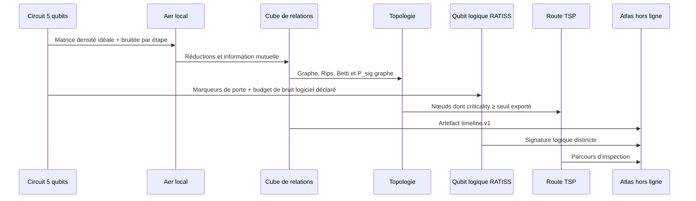

# Proof of Concept — cartographie topologique locale

## Hypothèse de travail

Le POC vérifie qu’une trajectoire de circuit peut être convertie, localement et de façon reproductible, en un artefact qui conserve simultanément le cube de corrélations, la topologie du graphe, un noyau de qubit topologique logique simulé RATISS, des zones critiques et une route d’inspection.

Il ne cherche pas à prouver que le qubit logique RATISS est un qubit topologique matériel, ni à diagnostiquer une machine ou un organisme réel.

## Protocole exécuté



Le run de référence s’exécute par :

```bash
PYTHONPATH=src python3 -m ratiss_topological_decoherence.cli --output artifacts/full_timeline.json
PYTHONPATH=src pytest
```

## Résultat observé

Le run local produit onze observations. Le noyau logique RATISS, dérivé du `TopologicalQubit` existant, présente une signature `P_sig` de `1.214` à l’initialisation et `0.766` après le scénario de bruit logiciel. La couche de corrélation du circuit, elle, termine sans cycle H1 fini persistant dans cette configuration (`P_sig=0`, Betti `[1,0,0]`). Ces deux résultats sont cohérents avec le contrat : ils concernent deux objets topologiques distincts, et le document les maintient séparés.

À l’étape finale, les qubits `3` et `4` franchissent le seuil de criticité `0.38` exporté dans la configuration. La route déterministe `3 → 4 → 3` est résolue par Hold–Karp et exposée à l’atlas. Cette route répond à la question « dans quel ordre inspecter les zones critiques ? » ; elle ne mesure ni topologie, ni réparation.

## Contrôles automatisés

| Test | Contrôle |
|---|---|
| `test_topology.py` | Carré à cycle H1 fini détecté par Rips |
| `test_tsp.py` | Route exacte fermée et méthode déclarée |
| `test_logical_qubit.py` | API du qubit logique RATISS, signature et bruit logiciel |
| `test_pipeline.py` | Schéma, provenance locale, cube, noyau logique et route TSP non triviale |
| `atlas/tests/verify-artifact.mjs` | Compatibilité de l’artefact calculé avec l’atlas local |

## Limites et prochaine itération

Le cube emploie l’information mutuelle normalisée, qui englobe des corrélations quantiques et classiques. La concurrence est donc exportée comme information complémentaire et non comme équivalent du cube. Le Rips embarqué privilégie la lisibilité sur de petits graphes ; une adaptation à plus grande échelle devra sélectionner un backend de persistance spécialisé et comparer les diagrammes.

L’extension « bio-cohérence » devra accepter une définition explicite de la donnée, du graphe et du bruit avant de réutiliser le mot cohérence. Le SDK peut fournir la pipeline d’inspection et la visualisation, mais il ne peut pas déduire une réalité biophysique ou un diagnostic sans protocole de mesure externe.
