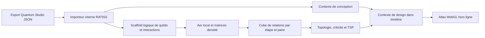

# Contrat interne — Quantum Circuit Studio × RATISS

## Principe d’unification

Le document JSON local produit par le **Quantum Circuit Studio** est la source de vérité de conception. Le moteur RATISS le lit comme un schéma de circuit, construit une trajectoire logique simulée, puis ajoute à l’artefact ses métriques de corrélation, topologie, criticité et inspection. Le moteur ne réécrit jamais le JSON Studio et le Studio source n’est pas modifié par cette intégration.



## Mapping contrôlé

| Élément Studio | Lecture par l’importeur RATISS | Ce qu’il ne signifie pas |
|---|---|---|
| `node.kind == qubit` | Un qubit logique du registre Aer, avec ID stable, fréquence nominale et position Studio | Un qubit calibré ou un composant matériel réalisé |
| `coupler` relié à deux qubits | Une interaction logique `cz` inférée entre ces deux qubits | Une force de couplage, un pulse ou une calibration |
| Arête directe qubit ↔ qubit | Une interaction logique `cz` inférée | Une capacité ou inductance extraite |
| `resonator`, `feedline`, `flux` | Du contexte de conception et d’inspection, conservé dans `design_context` | Une géométrie EM, une ligne routée ou un PDK |
| `frequency`, collision et diaphonie Studio | Un overlay de risque nominal visible dans l’artefact | Une prédiction de crosstalk ou une calibration matérielle |
| `x`, `y` | Coordonnées de visualisation cohérentes entre schéma et Atlas | Des dimensions lithographiques |

## Règles de compilation

1. Les qubits sont ordonnés par leur apparition dans `nodes`, et l’artefact conserve la table `studio_id → index_ratiss`.
2. Pour chaque coupler relié à au moins deux qubits, l’importeur ajoute un `cz` par paire unique de qubits adjacents dans la liste de liens. Les arêtes directes qubit ↔ qubit ajoutent la même interaction si elle n’existe pas déjà.
3. Le compilateur ajoute une préparation `h` sur chaque qubit impliqué dans une interaction pour générer une trajectoire d’observation non triviale. Cette préparation est étiquetée comme scaffold de simulation, jamais comme le contenu d’un programme matériel.
4. Les composants non qubit ne sont pas projetés dans le registre Aer. Ils restent visibles dans `design_context` et dans les vues de conception.
5. Le bruit Aer par défaut reste un profil local déclaré. Les fréquences ou scores Studio ne le modifient pas automatiquement : un tel raccordement exigerait des paramètres matériels supplémentaires.

## Extension de l’artefact

Le contrat `timeline.v1` reçoit un objet optionnel `design_context` :

```json
{
  "source": {
    "schema": "quantum-circuit-studio/v0.1",
    "name": "transmon-microcell",
    "mode": "internal_studio_import"
  },
  "qubit_map": [{"studio_id": "q0", "ratiss_index": 0}],
  "components": [],
  "links": [],
  "frequency_overlay": [],
  "crosstalk_overlay": [],
  "compilation": {
    "kind": "logical_scaffold",
    "hardware_calibrated": false
  }
}
```

L’Atlas peut le dessiner comme overlay de conception. Il doit garder distincts les risques Studio nominaux et la criticité calculée par la trajectoire Aer.

## Portes externes

Les adaptateurs Qiskit statevector, photonique et bio-cohérence ne contournent pas ce contrat. Ils arrivent comme sources alternatives sous une provenance distincte, par exemple `external_qiskit_statevector`. Le chemin Studio est le chemin **interne de conception** ; les adaptateurs sont des chemins **d’ingestion**.

## Frontière de fabrication

L’unification rend possible une conception orientée vers la fabrication, une analyse logique et une visualisation topologique dans le même flux. Elle ne rend pas le Studio capable de générer un masque, d’extraire des modes, de prévoir les rendements, de calibrer un qubit ou de valider une fabrication. Ces étapes exigent leurs propres données et outils physiques.
